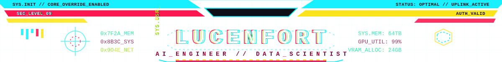

  

# Luciano Arruda

	

**Engenheiro de Computação**, com interesses em **Data & AI**, **MLOps**, análise de dados, visão computacional e integração **IoT**.

## Navegação Rápida

[Foco Atual](#foco-atual) • [Stack](#stack) • [Status](#status) • [Projetos](#projetos) • [Contato](#contato)

## Foco Atual

- Ciência de Dados aplicada a problemas reais de negócio
- Engenharia de IA: desenvolvimento, avaliação e deploy de modelos
- MLOps para reprodutibilidade, monitoramento e melhoria contínua

## Stack

	
	
	
	
	

	
	
	
	
	

## Status

	
	

	

## Projetos

<table>
	<tr>
		<td>
			<h3>fan-audio-fault-detection</h3>
			

				
			

			

				Solução de detecção de falhas em ventiladores industriais a partir de sinais de áudio.
			

			

				
Detalhes técnicos

				<ul>
					<li><strong>Objetivo:</strong> identificar padrões de anomalia e reduzir tempo de diagnóstico em manutenção.</li>
					<li><strong>Abordagem:</strong> extração de features acústicas (MFCC) e classificação supervisionada.</li>
					<li><strong>Stack principal:</strong> Python, Scikit-learn, processamento de áudio.</li>
				</ul>
			

		</td>
	</tr>
	<tr>
		<td>
			<h3>deep-learning-activation-functions</h3>
			

				
			

			

				Projeto técnico para comparação prática de funções de ativação em redes neurais.
			

			

				
Detalhes técnicos

				<ul>
					<li><strong>Objetivo:</strong> avaliar impacto das ativações no comportamento de treino e convergência.</li>
					<li><strong>Abordagem:</strong> implementação de funções e experimentos comparativos em diferentes cenários.</li>
					<li><strong>Stack principal:</strong> Python, fundamentos de Deep Learning.</li>
				</ul>
			

		</td>
	</tr>
	<tr>
		<td>
			<h3>olistbr-brazilian-ecommerce</h3>
			

				
			

			

				Análise de dados de e-commerce brasileiro com foco em insights para decisão de negócio.
			

			

				
Detalhes técnicos

				<ul>
					<li><strong>Objetivo:</strong> identificar padrões de receita, logística e comportamento de compra.</li>
					<li><strong>Abordagem:</strong> análise exploratória, limpeza de dados e geração de indicadores.</li>
					<li><strong>Stack principal:</strong> Python, Pandas, SQL.</li>
				</ul>
			

		</td>
	</tr>
</table>

## Contato

	
	
	

  

